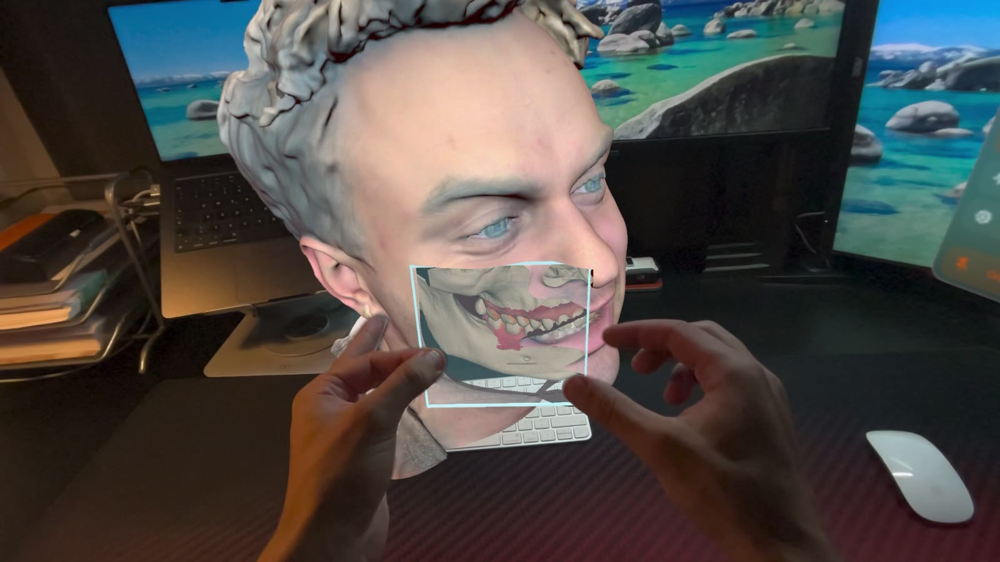
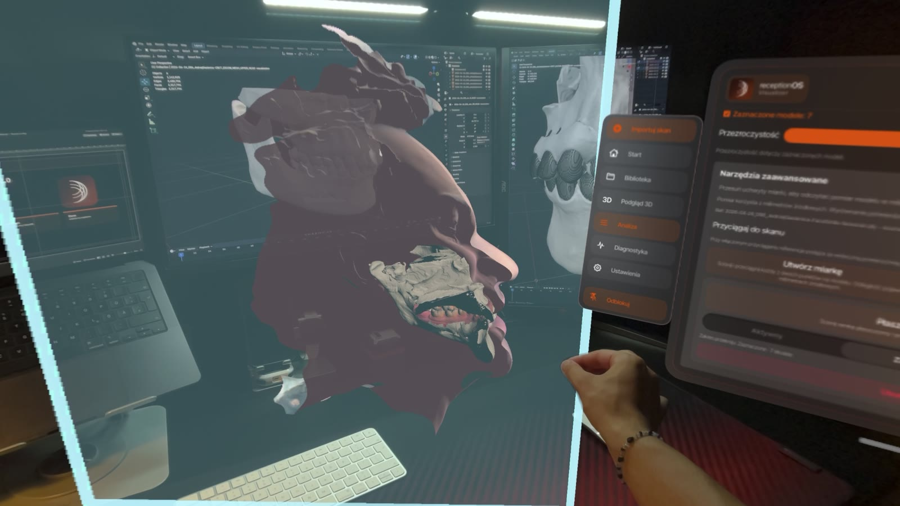

# receptionOS Visualizer

Client-delivered Apple Vision Pro workspace for local inspection and measurement of aligned 3D scan data.

`visionOS` · `SwiftUI` · `Unity 6` · `C#` · `URP` · `Metal` · `IL2CPP` · `arm64`

- **My role:** end-to-end product architecture, native visionOS integration, Unity runtime, rendering, spatial tools, validation and release stabilization
- **Accepted release:** `2.1.5 / Build 155`
- **Device:** Apple Vision Pro, tested and accepted on physical hardware
- **Public scope:** architecture and device behavior are documented here; the client application source remains private

## On-device demo

### Spatial inspection and direct model interaction

**[Open the 24-second video](media/demo-02-spatial-inspection.mp4)**

### Aligned Face, jaw and CBCT composition

**[Open the 9-second video](media/demo-01-aligned-face-jaw-cbct.mp4)**

## The engineering problem

A scan does not become a dependable spatial object simply because its triangles render.

The application had to import scanner-derived geometry, preserve semantic model roles and alignment, maintain source scale across separate files, render Face, oral and CBCT data through different visual assumptions, coordinate native visionOS windows with an embedded Unity runtime and support measurements between surfaces belonging to different models.

The delivered workspace provides:

- local PLY, texture and alignment-sidecar import;
- multiple visible models in one aligned composition;
- role-aware rendering for Face, oral scans and CBCT;
- native multi-window inspection and calibration tools;
- geometry-level closest-point snapping for spatial measurement;
- deterministic lifecycle behavior across native and Unity state;
- Polish and English product UI.

## My engineering scope

I worked across the complete system:

- product and runtime architecture;
- SwiftUI windows, Files integration, localization and visionOS lifecycle;
- Objective-C++ and JSON bridge design;
- Unity model state, scene operations and spatial interaction;
- defensive PLY parsing and validation;
- role-aware URP/Metal rendering and Face performance stabilization;
- aligned composition logic and cross-model measurement;
- automated tests, export validation, signing checks and physical-device release acceptance.

## Hybrid by design

The application separates responsibilities rather than forcing the entire product into one framework.

- **Swift 6 and SwiftUI** own native windows, Files integration, localization, privacy-facing UI and visionOS lifecycle.
- **Objective-C++ and JSON** form an explicit protocol between the native shell and Unity.
- **Unity 6000.3.19f1 and C#** own scan import, mesh state, transforms, spatial tools and rendering logic.
- **URP and Metal** provide the real-time graphics path on Apple Vision Pro.
- **IL2CPP** converts managed Unity assemblies to C++ for ahead-of-time arm64 deployment through Apple's toolchain.

Bridge operations carry request identity and complete through terminal acknowledgement, postcondition checks and a published state snapshot. This prevents a stale native lifecycle effect from silently mutating a newer Unity scene.

## Import, rendering and spatial meaning

The importer handles ASCII and binary little-endian PLY, positions, triangles, normals, vertex colors, texture coordinates, external PNG/JPEG appearance data and optional `.matrix4` alignment sidecars. Semantic roles include Face, upper jaw, lower jaw and CBCT.

Validation runs before expensive mesh allocation. Accepted limits include 512 MB per input file, 1.5 million vertices, 3 million triangles and 10 models in one workspace.

Different roles then follow different rendering paths:

- Face rendering preserves source texture information while applying bounded color statistics and GPU-side naturalization.
- Oral scans combine scanner color with controlled cavity, depth, ambient-occlusion and material response.
- CBCT uses a separate profile so later calibration cannot silently change the accepted bone baseline.

The ruler operates on imported triangle surfaces, not model origins or bounding boxes. A BVH accelerates closest-point queries, while each endpoint remembers the model surface to which it is attached. Models in one aligned composition share a measurement context, so one point can attach to a tooth and the other to a separate Face surface without forcing both through one model transform.

## What physical-device testing changed

The simulator did not expose every production failure.

- A full Face-atlas correction on the CPU triggered the Apple Vision Pro watchdog. The accepted path bounds CPU statistics and moves per-pixel naturalization to the GPU.
- A native window and singleton-runtime race produced stale lifecycle completions. Reducer-style state with explicit run and effect identity made startup and reconnection deterministic.
- Rendering improvements once changed an already accepted visual baseline. The accepted zero-settings appearance is now treated as regression evidence, not as a value later features may reinterpret.

## Relevance to immersive research systems

The same properties that make this product stable also matter when an immersive application becomes experimental apparatus:

- deterministic scene and lifecycle state support repeatable conditions;
- explicit coordinate and scale semantics protect spatial variables;
- immutable visual baselines reduce uncontrolled stimulus variation;
- physical-device profiling prevents simulator-only conclusions;
- limitations are exposed instead of being hidden behind plausible-looking output.

This is a visualization product, not a completed perception experiment. It demonstrates the engineering foundation on which controlled immersive research can be built.

## Validation

The accepted build recorded **36,115 authored lines** across Swift, Objective-C++, C#, shaders and tests, excluding generated and exported code.

Validation included:

- 101 Unity EditMode tests and 33 PlayMode tests;
- Swift 6 / XROS strict compilation;
- clean fail-closed Unity-to-Xcode export;
- unsigned and signed builds;
- codesign, plist, target-membership, multi-scene and privacy checks;
- acceptance of the exact build on physical Apple Vision Pro hardware.

## Scope and confidentiality

This repository contains no application source, exported Xcode project, patient data, raw scans, private fixtures, signing material or client-confidential release assets.

The product is described as a local-first spatial visualization system. No medical-device certification, diagnostic-accuracy or clinical-outcome claim is made.

## References

- [Apple visionOS](https://developer.apple.com/visionos/)
- [Unity development for visionOS](https://docs.unity3d.com/6000.0/Documentation/Manual/visionOS.html)
- [Unity IL2CPP](https://docs.unity3d.com/6000.0/Documentation/Manual/scripting-backends-il2cpp.html)

## Contact

**Jakub Majewski**

[github.com/jacobemanuel](https://github.com/jacobemanuel)
