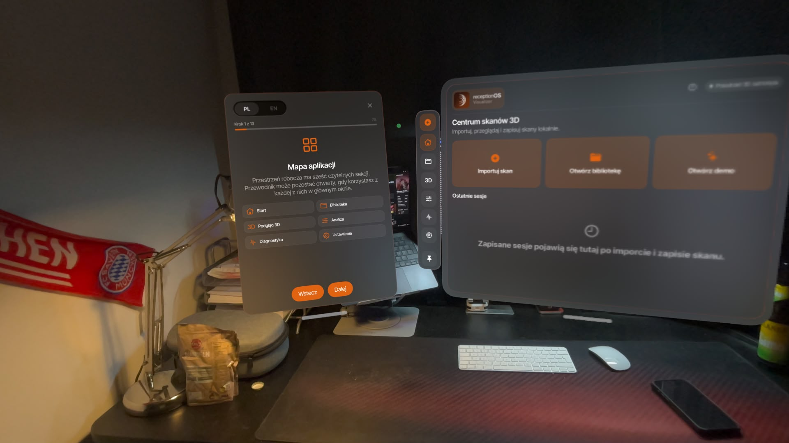
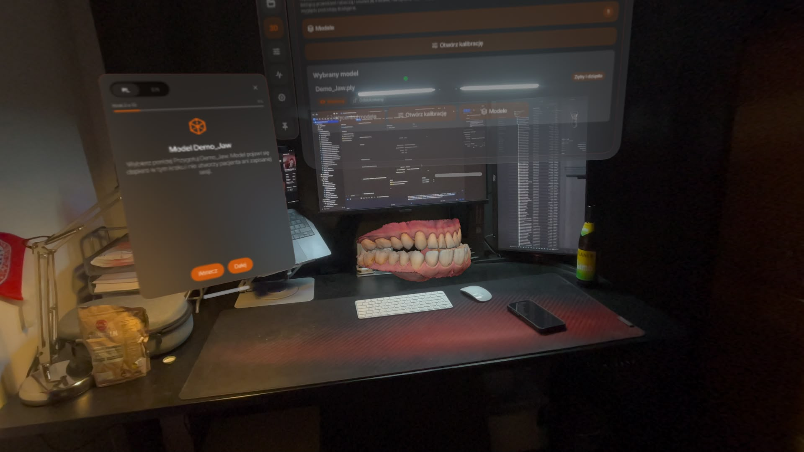
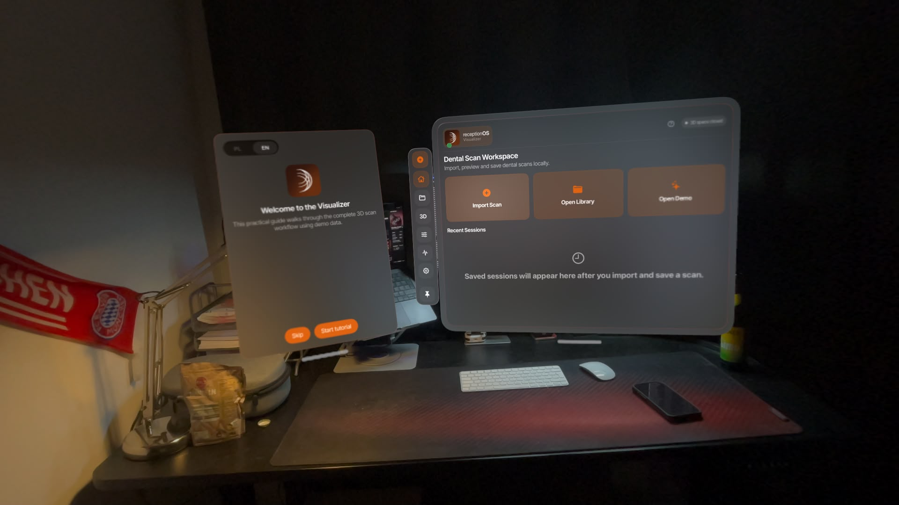
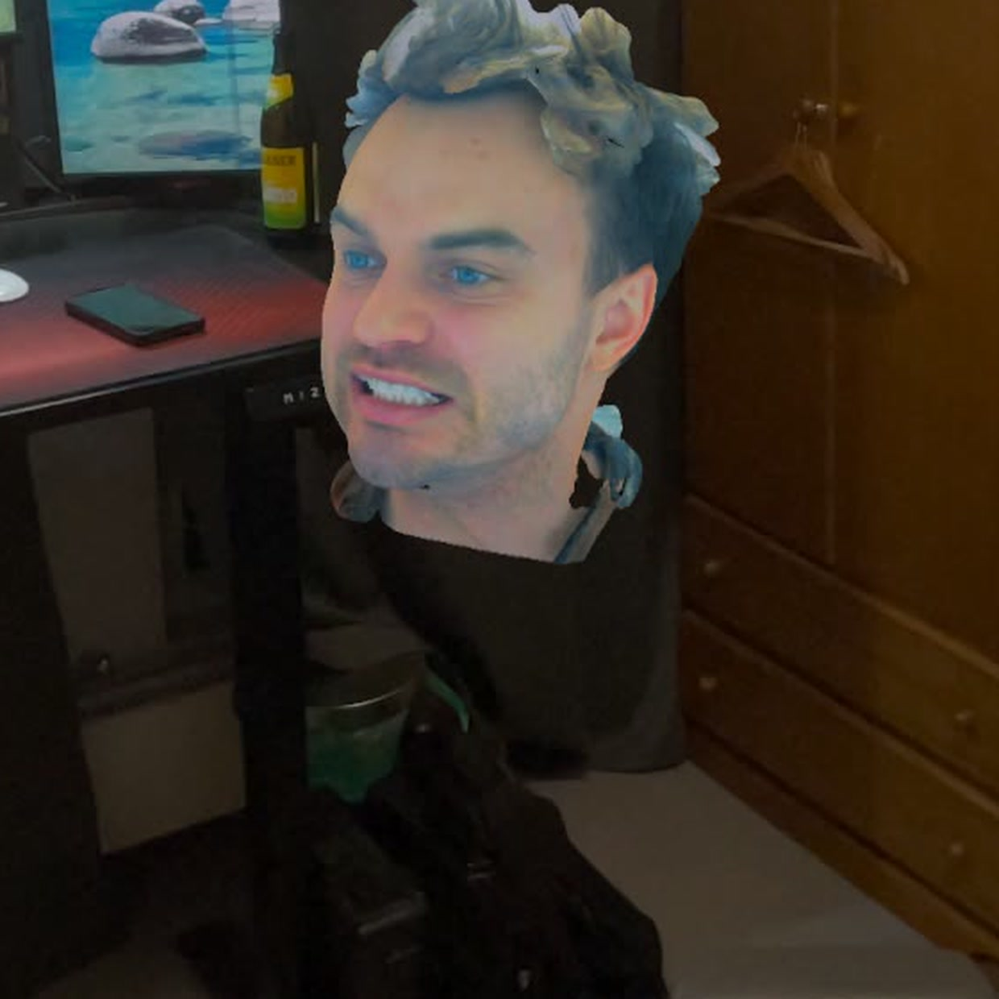
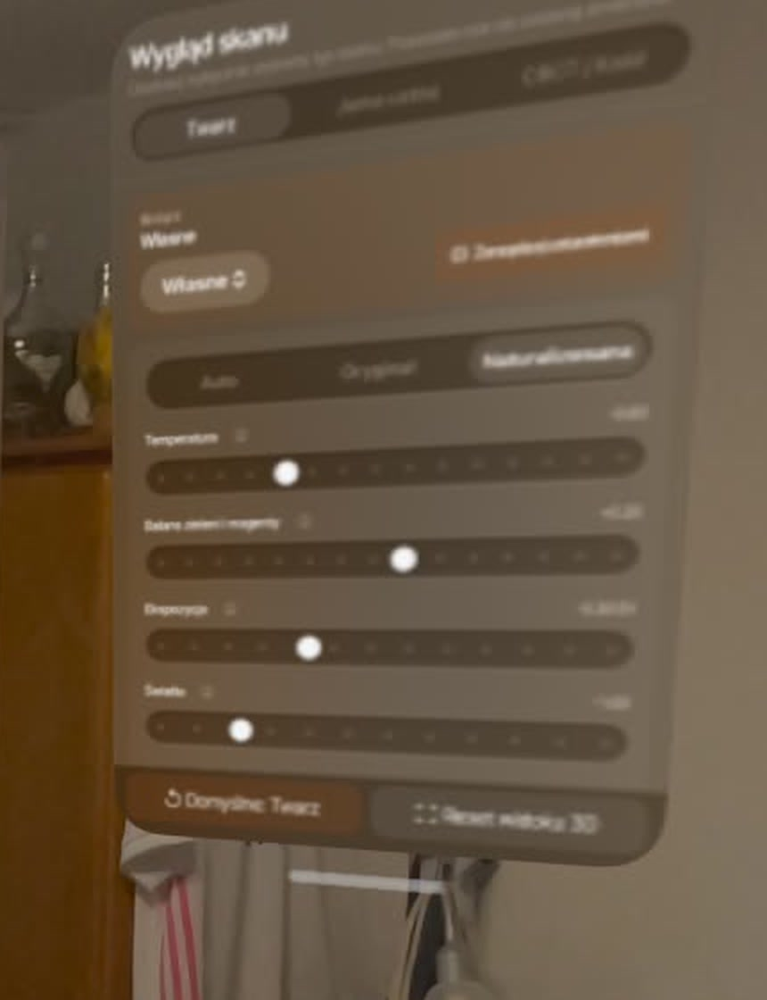
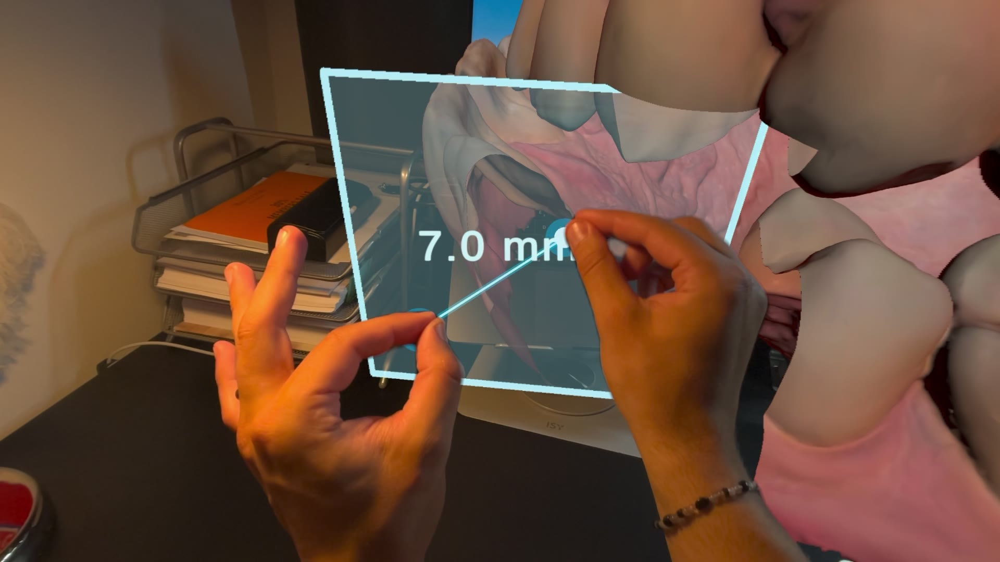

# receptionOS Visualizer

**Rendering the scans was the easy part. Making SwiftUI, Unity, scanner data and spatial scale agree on what they meant was the real product.**

`visionOS` · `SwiftUI` · `Unity 6` · `C#` · `URP` · `Metal` · `IL2CPP` · `arm64`

| My role | Platform | Delivered | Public scope |
|---|---|---|---|
| End-to-end product architecture, native integration, Unity runtime, rendering, spatial tools and release stabilization | Apple Vision Pro | `2.1.5 / Build 155`, accepted on physical hardware | Architecture, engineering decisions and de-identified device media; client source remains private |

## What shipped

The client already had the scans and the headset. What was missing was a workflow that made the two useful together. I independently took receptionOS Visualizer from an early proof of concept to a client-delivered Apple Vision Pro application.

It imports scanner-derived files locally, reconstructs aligned multi-model compositions and renders Face, oral-scan and CBCT data through separate role-specific paths. This is what the application actually does:

- local PLY, texture and alignment-sidecar import;
- multiple visible models in one aligned spatial composition;
- semantic roles for Face, upper jaw, lower jaw and CBCT;
- role-aware rendering and bounded calibration;
- native multi-window inspection, model management and onboarding;
- geometry-level surface snapping and cross-model measurement;
- deterministic synchronization between the native shell and Unity runtime;
- Polish and English product UI.

| Native product shell | Import and role assignment | Spatial onboarding |
|---|---|---|
|  |  |  |

These are captures from the physical Apple Vision Pro. The simulator was useful, but it did not get the final vote.

## On-device workflows

### Face texture naturalization and calibration

| GPU-naturalized Face rendering | Bounded calibration on the physical headset |
|---|---|
|  |  |

Scanner textures can arrive with a strong color cast. The accepted renderer keeps the original appearance available, calculates bounded statistics for the imported scan and applies naturalization per pixel on the GPU rather than baking a new atlas on the CPU. The user can switch between Auto, Original and Naturalized modes, then make bounded manual corrections to temperature, tint, exposure and tonal response.

The correction is reversible and visible. It is not presented as anatomical segmentation, and it does not silently rewrite the source texture.

### Cross-model surface measurement

**[Open the 10-second measurement video](media/demo-03-surface-measurement.mp4)**

Each ruler endpoint snaps independently to the closest eligible triangle surface. In an aligned composition, the endpoints may belong to different models while the distance remains expressed in one shared source-scale context. The runtime keeps the identity of both attached surfaces and invalidates the measurement when its composition context is broken.

### Spatial inspection and direct model interaction

**[Open the 5-second spatial inspection video](media/demo-02-spatial-inspection.mp4)**

The user can move between a close surface inspection and the broader aligned composition without turning the scene into a fixed presentation. Hand interaction, model state and native windows remain part of one product workflow.

### Aligned Face, jaw and CBCT composition

**[Open the 9-second aligned-composition video](media/demo-01-aligned-face-jaw-cbct.mp4)**

The Face surface, jaws and CBCT-derived geometry are separate files. Their shared scale and optional alignment transforms must remain meaningful after import; otherwise a visually plausible overlay can still be spatially wrong.

## The architecture changed three times

The problem kept getting more honest, so the architecture changed with it. What began as a native visionOS and RealityKit proof of concept moved through a Unity plus PolySpatial bounded-volume prototype and into an intentional production hybrid. PolySpatial accelerated early spatial iteration; the delivered system needed native product ownership and direct control over large-mesh processing, shaders and lifecycle.

That evolution was driven by constraints rather than framework preference:

1. **Native Swift and RealityKit prototype:** validated the Apple Vision Pro interaction concept and local-file workflow.
2. **Unity plus PolySpatial prototype:** accelerated spatial interaction and bounded-volume experimentation.
3. **SwiftUI plus Unity URP/Metal hybrid:** separated native product concerns from the high-control 3D runtime required for imported scan data.

## Why the app is hybrid on purpose

The application gives each layer a clear owner.

- **Swift 6 and SwiftUI** own native windows, Files integration, localization, privacy-facing UI and visionOS lifecycle.
- **Objective-C++ and JSON** form a versioned command-and-state protocol between the native shell and Unity.
- **Unity 6000.3.19f1 and C#** own import, semantic model state, transforms, spatial tools and rendering logic.
- **URP and Metal** provide the real-time graphics path on Apple Vision Pro.
- **IL2CPP** converts managed Unity assemblies to C++ for ahead-of-time arm64 deployment through Apple's toolchain.

The bridge is treated as a protocol, not a loose collection of callbacks. Operations carry request identity and complete through terminal acknowledgement, postcondition checks and a published state snapshot. Startup commands are queued until the runtime is ready, while stale lifecycle effects are prevented from mutating a newer scene.

## The three problems that mattered

### 1. Scanner interoperability

The importer handles ASCII and binary little-endian PLY, positions, triangles, normals, vertex colors, texture coordinates, external PNG or JPEG appearance data and optional `.matrix4` alignment sidecars.

Import is treated as a validation pipeline, not a file-open shortcut. Geometry, appearance data, role metadata and optional alignment sidecars are checked before expensive mesh allocation, then published into one deterministic model state. Accepted limits include 512 MB per input file, 1.5 million vertices, 3 million triangles and 10 models in one workspace.

### 2. Role-aware rendering

A Face scan, an oral scan and CBCT-derived geometry need different rendering assumptions.

- **Face rendering** preserves source texture information while applying bounded color statistics and GPU-side naturalization.
- **Oral rendering** combines scanner color with controlled cavity, depth, ambient-occlusion and material response.
- **CBCT rendering** uses a separate profile so later calibration cannot silently change the accepted bone baseline.

Three experimental tooth-color controls remain disabled because the available color mask is not scanner-independent anatomical segmentation. Keeping the accepted visual baseline intact was more responsible than exposing controls that looked convincing on one scan but could alter gingiva or artifacts on another.

### 3. Shared scale and measurement

The ruler operates on imported triangle surfaces, not model origins or bounding boxes. A BVH accelerates closest-point queries, while each endpoint remembers the model surface to which it is attached.

For a standalone model, distance is evaluated in that model's source-space context. For an aligned composition, every eligible model shares one measurement context, allowing one point to attach to a tooth and the other to a separate Face surface without forcing both through the transform of one arbitrarily active model.

## The device had the final word

The simulator let several bad assumptions survive. Apple Vision Pro did not.

- **Build 149, Face-processing watchdog:** a full CPU atlas correction blocked long enough to trigger the Apple Vision Pro watchdog. The accepted path bounds CPU statistics and moves per-pixel naturalization to the GPU.
- **Build 151, lifecycle race:** a native window and singleton Unity runtime produced stale startup completions. Reducer-style state with explicit run and effect identity made startup and reconnection deterministic.
- **Visual-baseline regression:** a later rendering improvement changed an already accepted CBCT appearance. The accepted zero-settings appearance from V7 / Build 148 was frozen as visual regression evidence, so later features could not silently redefine the baseline.

Those failures changed the architecture. They were not papered over as device-specific edge cases.

## Validation and delivery evidence

The accepted release contained **36,115 authored lines** across Swift, Objective-C++, C#, shaders and tests, excluding generated and exported code.

Validation included:

- **101 Unity EditMode tests** and **33 PlayMode tests**;
- Swift 6 / XROS strict compilation;
- clean fail-closed Unity-to-Xcode export;
- unsigned and signed builds;
- codesign, plist, target-membership, multi-scene and privacy checks;
- acceptance of the exact build on physical Apple Vision Pro hardware.

## Relevance to immersive research systems

An immersive application becomes experimental apparatus the moment scene state, coordinate scale, rendering baselines or device performance can change the observation. At that point, they are not implementation details anymore.

That is the foundation I built here: deterministic lifecycle state, explicit spatial semantics, fixed visual references, physical-device profiling and limitations that remain visible instead of being hidden. It is a visualization product, not a completed perception experiment, but the same engineering discipline is required before spatial behavior can support a controlled study.

That is the part I find interesting: not just making spatial software look convincing, but making it stable enough that someone can trust what they are seeing.

## Scope and confidentiality

Portfolio media is limited to de-identified demonstration views supplied for public use. The repository contains no identifying patient metadata, raw private scans, clinical records, application source, exported Xcode project, signing material or client-confidential release assets.

The product is described as a local-first spatial visualization system. No medical-device certification, diagnostic-accuracy or clinical-outcome claim is made.
